- [1. Session 1](#1-session-1)
  - [1.1. Team](#11-team)
  - [1.2. What is a neural network neuron?](#12-what-is-a-neural-network-neuron)
  - [1.3. What is the use of the learning rate?](#13-what-is-the-use-of-the-learning-rate)
  - [1.4. How are weights initialized?](#14-how-are-weights-initialized)
    - [1.4.1. Different Weight Initialization Techniques](#141-different-weight-initialization-techniques)
    - [1.4.2. Zero Initialization (Initialized all weights to 0)](#142-zero-initialization-initialized-all-weights-to-0)
    - [1.4.3. Random Initialization (Initialized weights randomly)](#143-random-initialization-initialized-weights-randomly)
      - [1.4.3.1. (a) Vanishing gradients:](#1431-a-vanishing-gradients)
      - [1.4.3.2. (b) Exploding gradients :](#1432-b-exploding-gradients)
  - [1.5. What is "loss" in a neural network?](#15-what-is-loss-in-a-neural-network)
    - [1.5.1. Regression Problem](#151-regression-problem)
    - [1.5.2. Binary Classification Problem](#152-binary-classification-problem)
    - [1.5.3. Multi-Class Classification Problem](#153-multi-class-classification-problem)
  - [1.6. What is the "chain rule" in gradient flow?](#16-what-is-the-chain-rule-in-gradient-flow)
# 1. Session 1
## 1.1. Team

- Shilpa
- Shailesh J
- Prathyusha Kanakam
- Raja Rajendran
## 1.2. What is a neural network neuron?

A neural network neuron is similar to a biological neuron in terms of the mathematical operation it performs

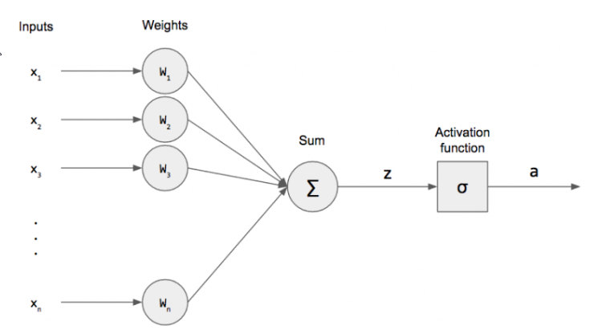  

In this model, 
- we have n binary `inputs` (usually given as a vector) 
- and exactly the same number of weights `W_1, ..., W_n`.
- We multiply these together and sum them up. We denote this as `z` and call it the pre-activation. We can re-write this as an inner product for succinctnes.

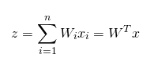  

There is another term, called the bias, that is just a constant factor.

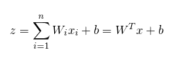  

For mathematical convenience, we can actually incorporate it into our weight vector as `W_0` and set `x_0` = +1 for all of our inputs. 

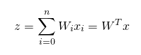  

After taking the weighted sum, we apply an activation function, `sigma`, to this and produce an activation `a`. The activation function for perceptrons is sometimes called a step function because, if we were to plot it, it would look like a stair.

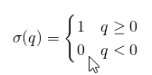  

In other words, if the input is greater than or equal to 0, then we produce an output of 1. Otherwise, we produce an output of 0. This is the `mathematical model for a single neuron`, the most fundamental unit for a neural networks.

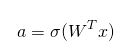  

Let’s compare this model to the biological neuron. The inputs are analogous to the dendrites, and the weights model the synapse. We combine the weighted inputs by summing and send that weighted sum to the activation function. This acts as our all-or-nothing response function where 0 means the neuron didn’t produce an output. Also note that our inputs and outputs are also binary, which is in accordance with the biological model.

[https://pythonmachinelearning.pro/perceptrons-the-first-neural-networks/](https://pythonmachinelearning.pro/perceptrons-the-first-neural-networks/)
## 1.3. What is the use of the learning rate?

Learning rate is a hyper-parameter that controls how much we are adjusting the weights of our network with respect the loss gradient (computed using the chain rule: the partial derivative of loss wrt weight). The lower the value, the slower we travel along the downward slope. While this might be a good idea (using a low learning rate) in terms of making sure that we do not miss any local minima, it could also mean that we’ll be taking a long time to converge — especially if we get stuck on a plateau region.

The following formula shows the relationship.

`new_weight = existing_weight — learning_rate * gradient`

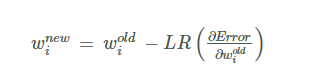  

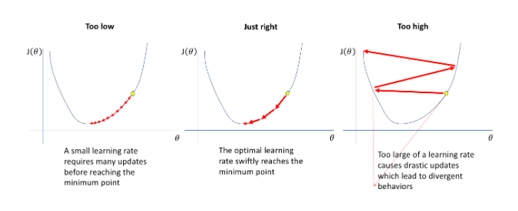  

Gradient descent with small (left), just right (middle) and large (right) learning rates.

The below diagram demonstrates the different scenarios one can fall into when configuring the learning rate.  Note that with an optimal learning rate, loss is minimized during training compared to other choices for the learning rate

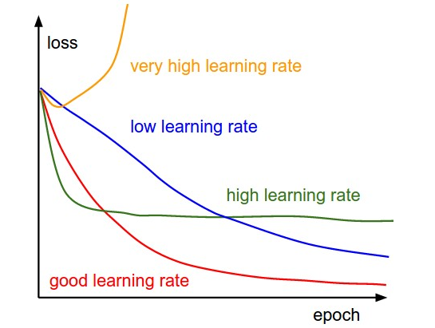  

Effect of various learning rates on convergence (Img Credit: cs231n)

Furthermore, the learning rate affects how quickly our model can converge to a local minima (aka arrive at the best accuracy). Thus getting it right from the get go would mean lesser time for us to train the model.

[https://towardsdatascience.com/understanding-learning-rates-and-how-it-improves-performance-in-deep-learning-d0d4059c1c10](https://towardsdatascience.com/understanding-learning-rates-and-how-it-improves-performance-in-deep-learning-d0d4059c1c10)
## 1.4. How are weights initialized?

Weights can be initialized with random values, except too close to zero values.  This reason for this is explained below

For a neural network having 2 layers, i.e. one hidden layer. (Here bias term is not added just for the simplicity)

Weights neural networks forward propagation

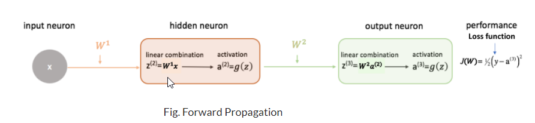  

Fig. Forward Propagation

backward propagation

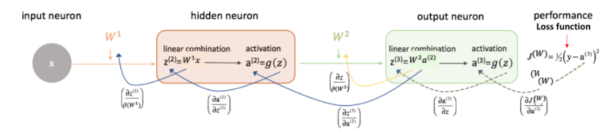  

Fig. Backward Propagation

Why Weight Initialization?
- Its main objective is to prevent `layer activation outputs from exploding or vanishing gradients during the forward propagation`. 
- If either of the problems occurs, loss gradients will either be too large or too small, and the network will take more time to converge if it is even able to do so at all.

If we initialized the weights correctly, then our objective i.e, optimization of loss function will be achieved in the least time otherwise converging to a minimum using gradient descent will be impossible.

### 1.4.1. Different Weight Initialization Techniques
One of the important things which we have to keep in mind while building your neural network is to initialize your weight matrix for different connections between layers correctly.

### 1.4.2. Zero Initialization (Initialized all weights to 0)
If we initialized all the weights with 0, then what happens is that the derivative wrt loss function is the same for every weight in W[l], thus all weights have the same value in subsequent iterations. This makes hidden layers symmetric and this process continues for all the n iterations. Thus initialized weights with zero `make your network no better than a linear model`. It is important to note that setting biases to 0 will not create any problems as non-zero weights take care of breaking the symmetry and even if bias is 0, the values in every neuron will still be different.

### 1.4.3. Random Initialization (Initialized weights randomly)

- This technique tries to address the problems of zero initialization since it prevents neurons from learning the same features of their inputs since our goal is to make each neuron learn different functions of its input and this technique gives much better accuracy than zero initialization.
- In general, it is used to break the symmetry. It is better to assign random values except 0 to weights.
- Remember, neural networks are very sensitive and prone to overfitting as it quickly memorizes the training data.

Now, after reading this technique a new question comes to mind: “What happens if the weights initialized randomly can be very high or very low?”

#### 1.4.3.1. (a) Vanishing gradients:

- For any activation function, abs(dW) will get smaller and smaller as we go backward with every layer during backpropagation especially in the case of deep neural networks. So, in this case, `the earlier layers’ weights are adjusted slowly`.
- Due to this, the weight update is minor which results in slower convergence.
- This makes the optimization of our loss function slow. It might be possible in the worst case, this `may completely stop the neural network from training further`.
- More specifically, in the case of the sigmoid and tanh and activation functions, if your weights are very large, then the gradient will be vanishingly small (because the derivative of tanh or sigmoid, close to its output value of '1', is very small), effectively preventing the weights from changing their value. This is because abs(dW) will increase very slightly or possibly get smaller and smaller after the completion of every iteration.
- So, here comes the use of the `RELU activation function` in which `vanishing gradients are generally not a problem` as the gradient is 0 for negative (and zero) values of inputs and 1 for positive values of inputs.
#### 1.4.3.2. (b) Exploding gradients : 

- This is the exact opposite case of the vanishing gradients, which we discussed above.
- Consider we have weights that are non-negative, large, and having small activations A. When these weights are multiplied along with the different layers, they cause a very large change in the value of the overall gradient (cost). This means that `the changes in W, given by the equation W= W — ⍺ * dW ( ⍺ is the learning rate), will be in huge steps`, the downward moment will increase.

In summary, Weights can be initialized with random values, except with too close to zero values.

for further details see: <https://www.analyticsvidhya.com/blog/2021/05/how-to-initialize-weights-in-neural-networks/>

## 1.5. What is "loss" in a neural network?

Deep learning neural networks are trained using the stochastic gradient descent optimization algorithm.

As part of the optimization algorithm, the error for the current state of the model must be estimated repeatedly. This requires the choice of an error function, conventionally called a `loss function, that can be used to estimate the loss of the model so that the weights can be updated to reduce the loss on the next evaluation`.

Neural network models learn a mapping from inputs to outputs from examples and the choice of loss function must match the framing of the specific predictive modeling problem, such as classification or regression. Further, the configuration of the output layer must also be appropriate for the chosen loss function.

The best practice or default values for each problem type with regard to the output layer and loss function is shown below

### 1.5.1. Regression Problem
A problem where you predict a real-value quantity.

- Output Layer Configuration: One node with a linear activation unit.
- Loss Function: Mean Squared Error (MSE).
### 1.5.2. Binary Classification Problem
A problem where you classify an example as belonging to one of two classes.

The problem is framed as predicting the likelihood of an example belonging to class one, e.g. the class that you assign the integer value 1, whereas the other class is assigned the value 0.
- Output Layer Configuration: One node with a sigmoid activation unit.
- Loss Function: Cross-Entropy, also referred to as Logarithmic loss.

### 1.5.3. Multi-Class Classification Problem
A problem where you classify an example as belonging to one of more than two classes.

The problem is framed as predicting the likelihood of an example belonging to each class.

- Output Layer Configuration: One node for each class using the softmax activation function.
- Loss Function: Cross-Entropy, also referred to as Logarithmic loss.

for further details see
- <https://machinelearningmastery.com/how-to-choose-loss-functions-when-training-deep-learning-neural-networks/>
- <https://machinelearningmastery.com/loss-and-loss-functions-for-training-deep-learning-neural-networks/>

## 1.6. What is the "chain rule" in gradient flow?

The ``chain rule`` is used to compute the partial derivative of the loss wrt to the weights.  This computed partial dervitive or gradient is used to adjust the weights during backpropogation using the formula below..

`new_weight = existing_weight — learning_rate * gradient`

  

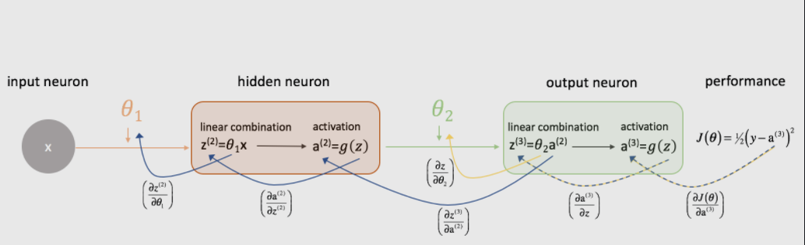  

Let's take a moment to examine how we could express the relationship between J(θ) and θ2. Note how θ2 is an input to z(3), which is an input to a(3), which is an input to J(θ). When we're trying to compute a derivative of this sort, we can use the ``chain rule`` to solve.

As a reminder, the chain rule states:
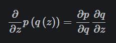  

Let's apply the chain rule to solve for ∂J(θ) / ∂θ2 ( 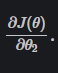  ).

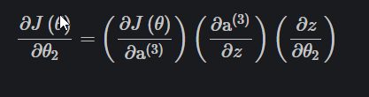  

By similar logic, we can find ∂J(θ) / ∂θ1.

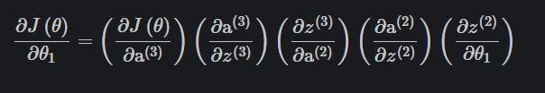  

<https://www.jeremyjordan.me/neural-networks-training/>
