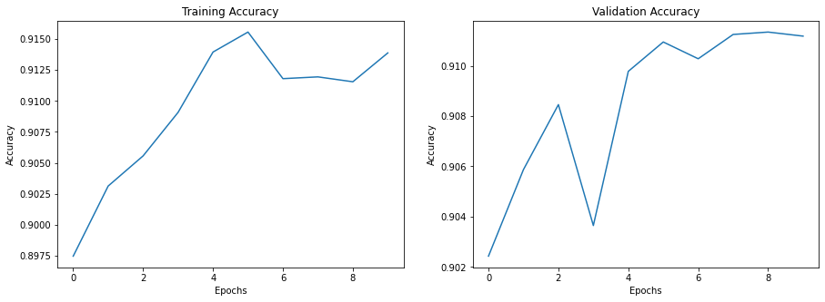
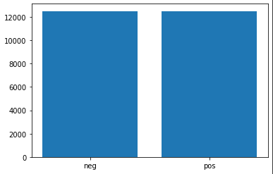
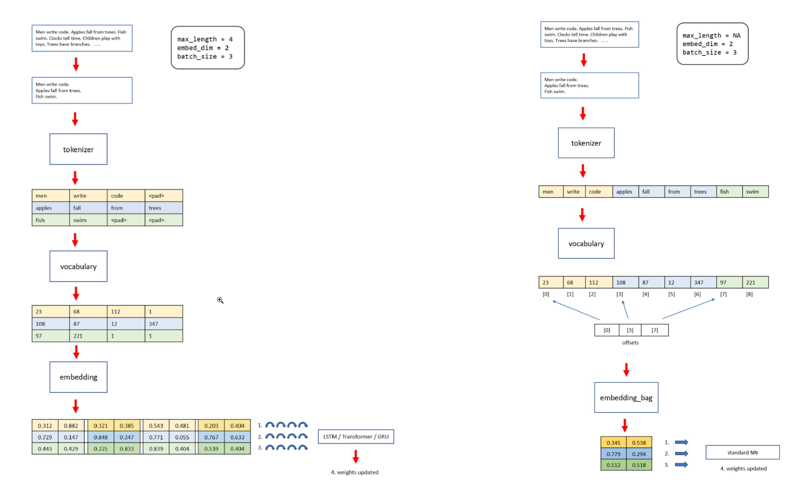

- [1. Team](#1-team)
- [2. Dataset 1 : Amazon Reviews Polarity](#2-dataset-1--amazon-reviews-polarity)
  - [2.1. 1.1 Dataset:](#21-11-dataset)
  - [2.2. 1.2 Text Classification:](#22-12-text-classification)
- [3. Dataset 2 : IMDB dataset](#3-dataset-2--imdb-dataset)
  - [3.1. Colab notebook](#31-colab-notebook)
  - [3.2. Dataset details](#32-dataset-details)
  - [3.3. Text classification using EmbeddingBag](#33-text-classification-using-embeddingbag)
  - [3.4. Result of training and validation run](#34-result-of-training-and-validation-run)
    - [3.4.1. Training run results using the train split](#341-training-run-results-using-the-train-split)
    - [3.4.2. Validation results using the test split](#342-validation-results-using-the-test-split)
    - [3.4.3. Inferencing with some example text](#343-inferencing-with-some-example-text)

## 1. Team

- Shilpa M
- Shailesh J
- Prathyusha Kanakam
- Raja Rajendran

## 2. Dataset 1 : Amazon Reviews Polarity 

### 2.1. 1.1 Dataset:
* The Amazon reviews polarity dataset is constructed by taking review score 1 and 2 as negative, and 4 and 5 as positive. 
* Samples of score 3 is ignored. 
* Each class has 1,800,000 training samples and 200,000 testing samples.

### 2.2. 1.2 Text Classification:
**Goal:** The dataset is used to classify reviews as positive or negative.

**Stats** ([Link to colab](S5_TorchText_AmazonReviewPolarity.ipynb)):

* No. of epochs: 10   
* Train Accuracy: 91.46%  
* Validation Accuracy: 91.1%   
* Test Accuracy: 91.12%
* Classwise Test Accuracy:
  1. Negative: 90.98%
  2. Positive: 91.25%
* The trend in the accuracy for the train and validation dataset:    
  
  
## 3. Dataset 2 : IMDB dataset

### 3.1. Colab notebook

<https://github.com/m-shilpa/END3/blob/main/Session_5_TorchText/S5_TorchText_IMDB.ipynb>

### 3.2. Dataset details

```text
Help on function IMDB in module torchtext.datasets.imdb:

IMDB(root='.data', split=('train', 'test'))
    IMDB dataset
    
    Separately returns the train/test split
    
    Number of lines per split:
        train: 25000
    
        test: 25000
    
    
    Number of classes
        2
    
    
    Args:
        root: Directory where the datasets are saved.
            Default: .data
        split: split or splits to be returned. Can be a string or tuple of strings.
            Default: ('train', 'test')
```

- the dataset has two classes: `pos` and `neg`
- has 2 splits: a `train` split with 25000 samples and a `test` split with 25,000 samples
- picture below shows the `train` split with 12500 `pos` and 12500 `neg` classes
  
- some sample lines from the dataset are shown below

```text
neg Worth the entertainment value of a rental, especially if you like action movies. This one features the usual car chases, fights with the great Van Damme kick style, shooting battles with the 40 shell load shotgun, and even terrorist style bombs. All of this is entertaining and competently handled but there is nothing that really blows you away if you've seen your share before.<br /><br />The plot is made interesting by the inclusion of a rabbit, which is clever but hardly profound. Many of the characters are heavily stereotyped -- the angry veterans, the terrified illegal aliens, the crooked cops, the indifferent feds, the bitchy tough lady station head, the crooked politician, the fat federale who looks like he was typecast as the Mexican in a Hollywood movie from the 1940s. All passably acted but again nothing special.<br /><br />I thought the main villains were pretty well done and fairly well acted. By the end of the movie you certainly knew who the good guys were and weren't. There was an emotional lift as the really bad ones got their just deserts. Very simplistic, but then you weren't expecting Hamlet, right? The only thing I found really annoying was the constant cuts to VDs daughter during the last fight scene.<br /><br />Not bad. Not good. Passable 4.
neg its a totally average film with a few semi-alright action sequences that make the plot seem a little better and remind the viewer of the classic van dam films. parts of the plot don't make sense and seem to be added in to use up time. the end plot is that of a very basic type that doesn't leave the viewer guessing and any twists are obvious from the beginning. the end scene with the flask backs don't make sense as they are added in and seem to have little relevance to the history of van dam's character. not really worth watching again, bit disappointed in the end production, even though it is apparent it was shot on a low budget certain shots and sections in the film are of poor directed quality
pos Previous reviewer Claudio Carvalho gave a much better recap of the film's plot details than I could. What I recall mostly is that it was just so beautiful, in every sense - emotionally, visually, editorially - just gorgeous.<br /><br />If you like movies that are wonderful to look at, and also have emotional content to which that beauty is relevant, I think you will be glad to have seen this extraordinary and unusual work of art.<br /><br />On a scale of 1 to 10, I'd give it about an 8.75. The only reason I shy away from 9 is that it is a mood piece. If you are in the mood for a really artistic, very romantic film, then it's a 10. I definitely think it's a must-see, but none of us can be in that mood all the time, so, overall, 8.75.
pos CONTAINS "SPOILER" INFORMATION. Watch this director's other film, "Earth", at some point. It's a better film, but this one isn't bad just different.<br /><br />A rare feminist point of view from an Indian filmmaker. Tradition, rituals, duty, secrets, and the portrayal of strict sex roles make this an engaging and culturally dynamic film viewing experience. All of the married characters lack the "fire" of the marriage bed with their respective spouses. One husband is celibate and commits a form of spiritual "adultery" by giving all of his love, honor, time and respect to his religious swami (guru). His wife is lonely and yearns for intimacy and tenderness which she eventually finds with her closeted lesbian sister-in-law who comes to live in their house with her unfaithful husband. This unfaithful husband is openly in love with his Chinese mistress but was forced into marriage with a (unbeknownest to him) lesbian. They only have sex once when his closet lesbian wife loses her virginity.<br /><br />A servant lives in the house and he eventually reveals the secret that the two women are lovers. Another significant character is the elderly matriarch who is unable to speak or care for herself due to a stroke. However, she uses a ringing bell to communicate her needs as well as her displeasure with the family members. She lets them know through her bell or by pounding her fist that she knows exacly what's going on in the house and how much she disapproves.<br /><br />In the end, the truth about everybody comes out and the two female lovers end up running away together. But, not before there is an emotional scene between the swami-addicted husband and his formerly straight wife. Her sari catches on fire and at first we think she is going to die. However, we see the two women united in the very last scene of the movie.<br /><br />The writer/director of this film challenges her culture's traditions, but she shows us individual human beings who are trapped by their culture and gender. We come to really care about the characters and we don't see them as stereotypes. Each on surprises us with their humanity, vulgarity, tenderness, anger, and spirit.
```

### 3.3. Text classification using EmbeddingBag

This article explains in good detail what an EmbeddingBag is, how it differs from word embeddings and where it is well suited: https://jamesmccaffrey.wordpress.com/2021/04/14/explaining-the-pytorch-embeddingbag-layer/

- The diagram below shows how a standard Embedding layer works (flow on the left), and how an EmbeddingBag works (flow on the right). 
- A regular Embedding layer creates a vector of values (the number of values is the embed_dim) for each word. When you batch items together for a sequential type NN such as am LSTM or Transformer, you must make all items the same length and so you must pad short sentences. This is a real pain.
  - see left half of picture below: there are 3 input sentences.  And the embedding produced for each sentence is color coded with 'yellow', 'blue' and 'green
- With an EmbeddingBag, you don’t need padding. You connect the sentences together into an input batch and record where each sentence starts in an offsets array. 
- Instead of each word being represented by an embedding vector, with an EmbeggingBag, each sentence is represented by an embedding vector. This simplification loses the sequential information so you use a simple neural network.
  - see right half of picture below: there are 3 input sentences.  And the embedding produced for each sentence is color coded with 'yellow', 'blue' and 'green
- The EmbeddingBag with a standard neural network approach is much simpler than the Embedding layer with a LSTM or Transformer. The EmbeddingBag approach is often viable for situations where the input sequences are just one or two sentences
  

### 3.4. Result of training and validation run

#### 3.4.1. Training run results using the train split

```text
epoch= 1 Accuracy=0.714375 batch_id=350: 100%|██████████| 372/372 [00:04<00:00, 85.91it/s]
validation accuracy    0.646 
epoch= 2 Accuracy=0.7921875 batch_id=350: 100%|██████████| 372/372 [00:04<00:00, 87.95it/s]
validation accuracy    0.786 
epoch= 3 Accuracy=0.805 batch_id=350: 100%|██████████| 372/372 [00:04<00:00, 87.33it/s]
validation accuracy    0.698 
epoch= 4 Accuracy=0.853125 batch_id=350: 100%|██████████| 372/372 [00:04<00:00, 88.19it/s]
validation accuracy    0.854 
epoch= 5 Accuracy=0.85 batch_id=350: 100%|██████████| 372/372 [00:04<00:00, 88.82it/s]
validation accuracy    0.852 
```

#### 3.4.2. Validation results using the test split

```text
Checking the results of test dataset.
test accuracy    0.844

```

#### 3.4.3. Inferencing with some example text

```text
ground truth=negative; prediction=Negative; ex_text_str=Worth the entertainment value of a rental, especially if you like action movies. This one features the usual car chases, fights with the great Van Damme kick style, shooting battles with the 40 shell load shotgun, and even terrorist style bombs. All of this is entertaining and competently handled but there is nothing that really blows you away if you've seen your share before.<br /><br />The plot is made interesting by the inclusion of a rabbit, which is clever but hardly profound. Many of the characters are heavily stereotyped -- the angry veterans, the terrified illegal aliens, the crooked cops, the indifferent feds, the bitchy tough lady station head, the crooked politician, the fat federale who looks like he was typecast as the Mexican in a Hollywood movie from the 1940s. All passably acted but again nothing special.<br /><br />I thought the main villains were pretty well done and fairly well acted. By the end of the movie you certainly knew who the good guys were and weren't. There was an emotional lift as the really bad ones got their just deserts. Very simplistic, but then you weren't expecting Hamlet, right? The only thing I found really annoying was the constant cuts to VDs daughter during the last fight scene.<br /><br />Not bad. Not good. Passable 4. 

ground truth=negative; prediction=Negative; ex_text_str=its a totally average film with a few semi-alright action sequences that make the plot seem a little better and remind the viewer of the classic van dam films. parts of the plot don't make sense and seem to be added in to use up time. the end plot is that of a very basic type that doesn't leave the viewer guessing and any twists are obvious from the beginning. the end scene with the flask backs don't make sense as they are added in and seem to have little relevance to the history of van dam's character. not really worth watching again, bit disappointed in the end production, even though it is apparent it was shot on a low budget certain shots and sections in the film are of poor directed quality 

ground truth=positive; prediction=Positive; ex_text_str=Previous reviewer Claudio Carvalho gave a much better recap of the film's plot details than I could. What I recall mostly is that it was just so beautiful, in every sense - emotionally, visually, editorially - just gorgeous.<br /><br />If you like movies that are wonderful to look at, and also have emotional content to which that beauty is relevant, I think you will be glad to have seen this extraordinary and unusual work of art.<br /><br />On a scale of 1 to 10, I'd give it about an 8.75. The only reason I shy away from 9 is that it is a mood piece. If you are in the mood for a really artistic, very romantic film, then it's a 10. I definitely think it's a must-see, but none of us can be in that mood all the time, so, overall, 8.75. 

ground truth=positive; prediction=Positive; ex_text_str=CONTAINS "SPOILER" INFORMATION. Watch this director's other film, "Earth", at some point. It's a better film, but this one isn't bad just different.<br /><br />A rare feminist point of view from an Indian filmmaker. Tradition, rituals, duty, secrets, and the portrayal of strict sex roles make this an engaging and culturally dynamic film viewing experience. All of the married characters lack the "fire" of the marriage bed with their respective spouses. One husband is celibate and commits a form of spiritual "adultery" by giving all of his love, honor, time and respect to his religious swami (guru). His wife is lonely and yearns for intimacy and tenderness which she eventually finds with her closeted lesbian sister-in-law who comes to live in their house with her unfaithful husband. This unfaithful husband is openly in love with his Chinese mistress but was forced into marriage with a (unbeknownest to him) lesbian. They only have sex once when his closet lesbian wife loses her virginity.<br /><br />A servant lives in the house and he eventually reveals the secret that the two women are lovers. Another significant character is the elderly matriarch who is unable to speak or care for herself due to a stroke. However, she uses a ringing bell to communicate her needs as well as her displeasure with the family members. She lets them know through her bell or by pounding her fist that she knows exacly what's going on in the house and how much she disapproves.<br /><br />In the end, the truth about everybody comes out and the two female lovers end up running away together. But, not before there is an emotional scene between the swami-addicted husband and his formerly straight wife. Her sari catches on fire and at first we think she is going to die. However, we see the two women united in the very last scene of the movie.<br /><br />The writer/director of this film challenges her culture's traditions, but she shows us individual human beings who are trapped by their culture and gender. We come to really care about the characters and we don't see them as stereotypes. Each on surprises us with their humanity, vulgarity, tenderness, anger, and spirit. 

```